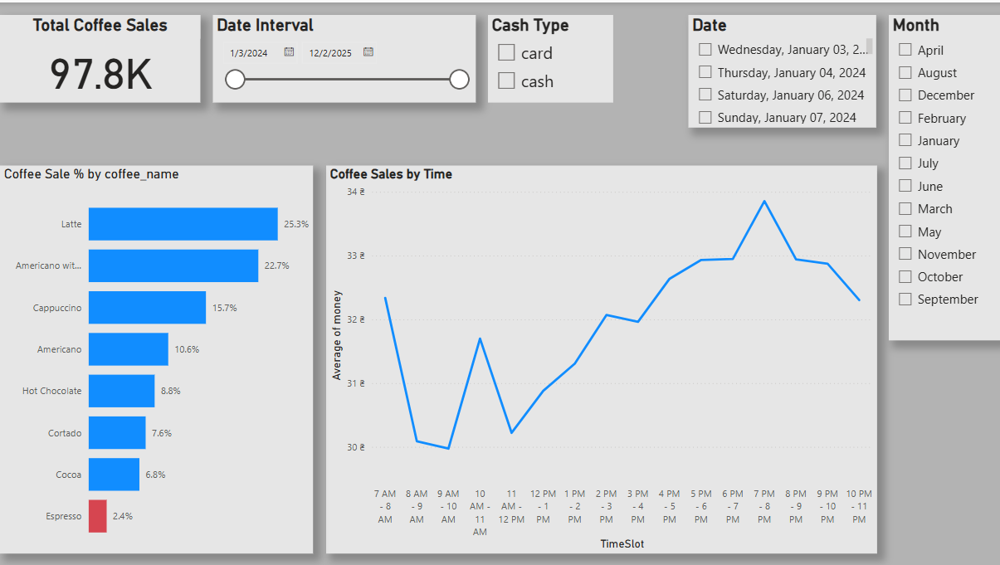

<header>

<!--
  <<< Author notes: Course header >>>
  Include a 1280×640 image, course title in sentence case, and a concise description in emphasis.
  In your repository settings: enable template repository, add your 1280×640 social image, auto delete head branches.
  Add your open source license, GitHub uses MIT license.
-->

# Coffee Sales Project


</header>

<!--
  <<< Author notes: Step 1 >>>
  Choose 3-5 steps for your course.
  The first step is always the hardest, so pick something easy!
  Link to docs.github.com for further explanations.
  Encourage users to open new tabs for steps!
-->

## Problem Statement

This dataset provides detailed records of coffee sales from a vending machine, created by the dataset author to support open data initiatives. It is designed for analyzing purchasing patterns, sales trends, and customer preferences for coffee products. This dashboard visualizes sales patterns by month, time, and percentage, offering valuable insights into trends and customer behavior.

In this project, we imported data from https://www.kaggle.com/datasets/ihelon/coffee-sales a CSV file into Power BI for analysis and visualization.

## Objectives

This project aims to:
1. Analyze coffee sales patterns by month.
2. Identify coffee sales **trends by hour**.
3. Analyze the **percentage distribution** of coffee sales by **coffee type**.


**Step 1**: 
1. Load the csv file in the Power BI.
2. Steps to create a BaseMeasure table: Home --> Enter Data --> Type the table name here and click on create.

## Creating a New Measure in Power BI  

To create a new measure in the **BaseMeasure** table, follow these steps:

i. Go to the **BaseMeasure** table.  
ii. Click on **"New Measure"** in the ribbon.  
iii. Copy and paste the following DAX code:

```DAX
Total Coffee Sale = SUM('Coffee Sales'[money])
```

Now, you can use this measure to calculate the total coffee sales in your Power BI reports.
4. Now go to --> Build --> card --> drag or select the (Total Coffee Sale) to visualize the total sale.

**Step 2**:
**Creating new columns in the Coffee Sales Table**
1. Make a new column Month using the following Dax formula
``` DAX
Month = FORMAT('Coffee Sales'[date], "MMMM")
```
2. Also make Hour Column to use in the next Time table using the DAX formula
   ```DAX
   Hour = HOUR('Coffee Sales'[datetime])
   ```
2. Now Go to --> Build --> select bar chart --> add Month to the x-axis and money to the Y-axis.

**Step 3**
**Creating new table**
1. Go to --> Modeling tab --> New table --> the copy this formula
 ```DAX
Time = 
ADDCOLUMNS(
    CROSSJOIN(
        GENERATESERIES(1, 12, 1), // Generates hours from 1 to 12 (12-hour format)
        DATATABLE("AM_PM", STRING, { {"AM"}, {"PM"} }) // Creates AM/PM values
    ),
    "Hour", [Value], // Stores the hour (1-12)
    "Time Slot", 
        SWITCH(
            TRUE(),
            [Value] = 12 && [AM_PM] = "AM", "Midnight",
            [Value] >= 1 && [Value] < 6 && [AM_PM] = "AM", "Midnight - 6 AM",
            [Value] >= 6 && [Value] < 12 && [AM_PM] = "AM", "Morning",
            [Value] = 12 && [AM_PM] = "PM", "Noon",
            [Value] >= 1 && [Value] < 6 && [AM_PM] = "PM", "Afternoon",
            [Value] >= 6 && [Value] < 12 && [AM_PM] = "PM", "Evening"
        )
)
```

 This will make a Time table and added four new columns (AM_PM, Hour, Time Slot, Value) to viualize the coffee sale trend by hour.

 **Step 4**:
 **Making new Relationships**
 1. Go to **Model View** → Drag the **Hour** column from the **Coffee Sales** table to the **Hour** column in the new **Time** table.
2. Now back to the Report view
3. Go to --> Build --> Line Chart --> Add Time Slot then Hour to the X-axis. And add money to the Y-axis.

**Step5**
**Duplicate the pane and add new measure to the BaseMeasure**
1. Go to BaseMeasure --> New measure and paste this formula
```DAX
Coffee Sale % = 
DIVIDE(
    [Total Coffee Sale], 
    CALCULATE([Total Coffee Sale], ALL('Coffee Sales'[coffee_name]))
)
```

2. Click on Coffee Sales by Month chart and Add **coffee_name** to Y-axis and **Coffee Sale %** to the X-axis


**Step6** 
**Adding slicers for 'Total Coffee Sales', 'Date Interval', 'Cash Type', 'Date' and 'Month'.

**End Results**

*figure1: Power BI Dashboard Overview*

Figure 1 reveals that the total coffee sales amounted to **$97.8K**. The *top contributing products were* **Latte**, **Americano with Milk**, and **Cappuccino**, contributing approximately **25.3%**, **22.7%**, and **15.7%**, respectively, to the overall revenue. On the other hand, **Espresso** recorded *the lowest contribution*, showing a negative growth of -2.4%.

In terms of sales trend by time of day, the data indicates a significant increase in coffee sales during the **afternoon to evening hours**, specifically from 2:00 PM (Afternoon) to 10:00 PM (Night).


